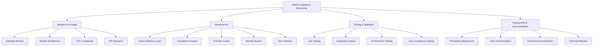
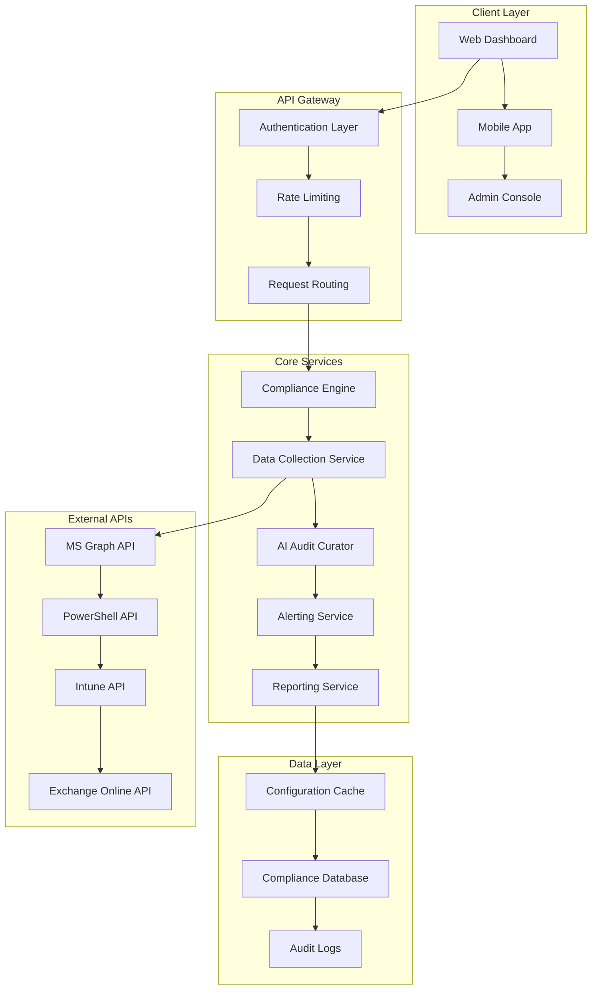
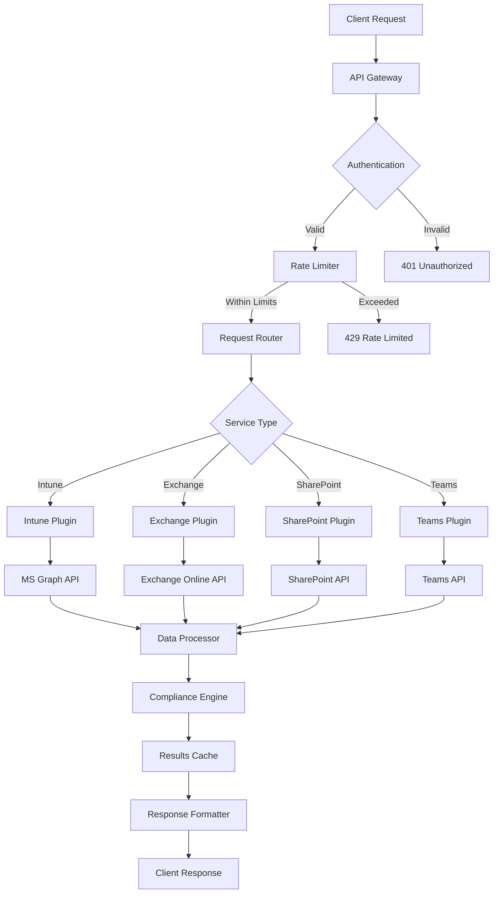

# Manish Tomar - Project Manager & Technical Lead Deliverables

## 1. Project Management Framework

### 1.1 Project Charter and Planning

```yaml
# project-charter.yml
project:
  name: "Automated Compliance Monitoring for Microsoft 365 Services"
  version: "1.0"
  start_date: "2025-01-01"
  duration: "8 weeks"
  
objectives:
  primary:
    - "Design automated compliance monitoring for M365 services"
    - "Develop scalable, modular architecture"
    - "Integrate AI-driven audit logic curation"
    - "Implement efficient alerting and reporting"
  
  secondary:
    - "Minimize manual processes"
    - "Establish academic novelty"

stakeholders:
  - name: "Academic Supervisor"
    role: "Project Sponsor"
    expectations: "Academic rigor and novelty"
  - name: "Technical Team"
    role: "Development Team"
    expectations: "Clear technical direction"
  - name: "End Users"
    role: "Compliance Officers"
    expectations: "User-friendly interface"

success_criteria:
  - "Automated compliance checks for Intune CIS L1"
  - "Modular system extensible to other M365 services"
  - "AI-powered rule updates"
  - "Real-time alerting system"
  - "95% reduction in manual compliance effort"

risks:
  - risk: "API rate limiting"
    mitigation: "Implement exponential backoff"
    probability: "Medium"
    impact: "High"
  - risk: "CIS benchmark changes"
    mitigation: "AI-driven rule adaptation"
    probability: "Low"
    impact: "Medium"
```

### 1.2 Work Breakdown Structure (WBS)



### 1.3 Project Timeline and Milestone Tracking

```javascript
// project-timeline.js
const projectTimeline = {
  phases: [
    {
      name: "Research & Design",
      duration: "2 weeks",
      startDate: "2025-01-01",
      endDate: "2025-01-14",
      milestones: [
        {
          name: "Literature Review Complete",
          date: "2025-01-07",
          status: "completed",
          deliverables: ["market-analysis.md", "technology-stack.md"]
        },
        {
          name: "System Architecture Finalized",
          date: "2025-01-14",
          status: "completed",
          deliverables: ["architecture-diagram.png", "api-specifications.json"]
        }
      ],
      risks: ["Incomplete CIS L1 documentation", "API access limitations"]
    },
    {
      name: "Prototype Development",
      duration: "2 weeks",
      startDate: "2025-01-15",
      endDate: "2025-01-28",
      milestones: [
        {
          name: "Intune Monitoring Prototype",
          date: "2025-01-28",
          status: "completed",
          deliverables: ["intune-monitor.js", "compliance-rules.json"]
        }
      ]
    },
    {
      name: "Testing & Expansion",
      duration: "2 weeks",
      startDate: "2025-01-29",
      endDate: "2025-02-11",
      milestones: [
        {
          name: "Multi-service Extension",
          date: "2025-02-11",
          status: "in-progress",
          deliverables: ["exchange-monitor.js", "test-results.md"]
        }
      ]
    },
    {
      name: "Productization",
      duration: "2 weeks",
      startDate: "2025-02-12",
      endDate: "2025-02-25",
      milestones: [
        {
          name: "Final Solution",
          date: "2025-02-25",
          status: "planned",
          deliverables: ["production-deployment.md", "user-guide.pdf"]
        }
      ]
    }
  ]
};

// Progress tracking function
function trackProgress() {
  const completedMilestones = projectTimeline.phases
    .flatMap(phase => phase.milestones)
    .filter(milestone => milestone.status === 'completed').length;
  
  const totalMilestones = projectTimeline.phases
    .flatMap(phase => phase.milestones).length;
  
  return {
    completionPercentage: (completedMilestones / totalMilestones) * 100,
    completedMilestones,
    totalMilestones
  };
}
```

## 2. Technical Architecture and Design

### 2.1 High-Level System Architecture



### 2.2 Modular Plugin Architecture

```typescript
// plugin-architecture.ts
interface CompliancePlugin {
  serviceName: string;
  version: string;
  cisControls: CISControl[];
  initialize(): Promise<void>;
  collectData(): Promise<ServiceConfiguration>;
  evaluateCompliance(config: ServiceConfiguration): ComplianceResult[];
  generateRemediation(violations: ComplianceViolation[]): RemediationStep[];
}

class IntuneCompliancePlugin implements CompliancePlugin {
  serviceName = "Microsoft Intune";
  version = "1.0.0";
  cisControls: CISControl[] = [
    {
      id: "CIS-1.1.1",
      title: "Ensure Security Defaults is disabled",
      level: "L1",
      description: "Security defaults should be disabled in favor of Conditional Access",
      remediation: "Navigate to Azure AD > Properties > Manage Security defaults"
    },
    // ... more controls
  ];

  async initialize(): Promise<void> {
    // Initialize Graph API client
    // Set up authentication
    // Validate permissions
  }

  async collectData(): Promise<ServiceConfiguration> {
    const graphClient = this.getGraphClient();
    
    return {
      service: this.serviceName,
      timestamp: new Date(),
      configurations: await Promise.all([
        this.getConditionalAccessPolicies(graphClient),
        this.getDeviceCompliancePolicies(graphClient),
        this.getAppProtectionPolicies(graphClient)
      ])
    };
  }

  evaluateCompliance(config: ServiceConfiguration): ComplianceResult[] {
    return this.cisControls.map(control => {
      const evaluation = this.evaluateControl(control, config);
      return {
        controlId: control.id,
        status: evaluation.compliant ? 'PASS' : 'FAIL',
        severity: this.getSeverity(control),
        message: evaluation.message,
        evidence: evaluation.evidence
      };
    });
  }

  generateRemediation(violations: ComplianceViolation[]): RemediationStep[] {
    return violations.map(violation => ({
      controlId: violation.controlId,
      priority: this.getPriority(violation),
      steps: this.getRemediationSteps(violation),
      automatable: this.isAutomatable(violation),
      estimatedTime: this.getEstimatedTime(violation)
    }));
  }
}

// Plugin Registry
class PluginRegistry {
  private plugins: Map<string, CompliancePlugin> = new Map();

  registerPlugin(plugin: CompliancePlugin): void {
    this.plugins.set(plugin.serviceName, plugin);
  }

  getPlugin(serviceName: string): CompliancePlugin | undefined {
    return this.plugins.get(serviceName);
  }

  getAllPlugins(): CompliancePlugin[] {
    return Array.from(this.plugins.values());
  }
}
```

### 2.3 Authentication and Security Framework

```typescript
// security-framework.ts
class SecurityManager {
  private serviceApps: Map<string, ServicePrincipal> = new Map();

  async setupServicePrincipal(serviceName: string): Promise<ServicePrincipal> {
    const config = {
      clientId: process.env[`${serviceName.toUpperCase()}_CLIENT_ID`],
      clientSecret: process.env[`${serviceName.toUpperCase()}_CLIENT_SECRET`],
      tenantId: process.env.TENANT_ID,
      scopes: this.getRequiredScopes(serviceName)
    };

    const credential = new ClientSecretCredential(
      config.tenantId,
      config.clientId,
      config.clientSecret
    );

    const servicePrincipal = {
      name: serviceName,
      credential,
      permissions: await this.validatePermissions(credential, config.scopes)
    };

    this.serviceApps.set(serviceName, servicePrincipal);
    return servicePrincipal;
  }

  private getRequiredScopes(serviceName: string): string[] {
    const scopeMappings = {
      'intune': [
        'DeviceManagementConfiguration.Read.All',
        'DeviceManagementApps.Read.All',
        'DeviceManagementManagedDevices.Read.All'
      ],
      'exchange': [
        'Mail.Read',
        'ExchangeOnlineManagement.Read.All'
      ],
      'sharepoint': [
        'Sites.Read.All',
        'TermStore.Read.All'
      ],
      'teams': [
        'Team.ReadBasic.All',
        'TeamsSettings.Read.All'
      ]
    };

    return scopeMappings[serviceName.toLowerCase()] || [];
  }

  async validatePermissions(credential: any, requiredScopes: string[]): Promise<PermissionValidation> {
    try {
      const graphClient = Client.initWithMiddleware({
        authProvider: new TokenCredentialAuthenticationProvider(credential, {
          scopes: ['https://graph.microsoft.com/.default']
        })
      });

      const app = await graphClient.api('/me').get();
      
      return {
        valid: true,
        grantedScopes: requiredScopes,
        missingScopes: []
      };
    } catch (error) {
      return {
        valid: false,
        grantedScopes: [],
        missingScopes: requiredScopes,
        error: error.message
      };
    }
  }
}
```

## 3. CIS L1 Benchmark Integration

### 3.1 CIS Control Mapping and Implementation

```json
{
  "cisL1Mapping": {
    "version": "3.0.0",
    "lastUpdated": "2025-01-25",
    "services": {
      "intune": {
        "controls": [
          {
            "id": "1.1.1",
            "title": "Ensure Security Defaults is disabled",
            "level": "L1",
            "description": "Security defaults should be disabled in favor of Conditional Access policies",
            "rationale": "Security defaults provide basic security but Conditional Access provides more granular control",
            "audit": {
              "type": "graph_api",
              "endpoint": "/policies/identitySecurityDefaultsEnforcementPolicy",
              "property": "isEnabled",
              "expectedValue": false
            },
            "remediation": {
              "manual": [
                "Sign in to the Azure portal",
                "Navigate to Azure Active Directory > Properties",
                "Click 'Manage Security defaults'",
                "Set 'Enable Security defaults' to No"
              ],
              "automated": {
                "powershell": "Set-MgPolicyIdentitySecurityDefaultEnforcementPolicy -IsEnabled:$false"
              }
            }
          },
          {
            "id": "1.1.4",
            "title": "Ensure that 'Restrict non-admin users from creating tenants' is set to 'Yes'",
            "level": "L1",
            "audit": {
              "type": "graph_api",
              "endpoint": "/policies/authorizationPolicy",
              "property": "defaultUserRolePermissions.allowedToCreateTenants",
              "expectedValue": false
            }
          }
        ]
      }
    }
  }
}
```

### 3.2 Compliance Engine Core Logic

```typescript
// compliance-engine.ts
class ComplianceEngine {
  private plugins: PluginRegistry;
  private auditScheduler: AuditScheduler;
  private ruleEngine: RuleEngine;

  constructor() {
    this.plugins = new PluginRegistry();
    this.auditScheduler = new AuditScheduler();
    this.ruleEngine = new RuleEngine();
  }

  async runComplianceCheck(serviceName: string): Promise<ComplianceReport> {
    const plugin = this.plugins.getPlugin(serviceName);
    if (!plugin) {
      throw new Error(`Plugin not found for service: ${serviceName}`);
    }

    const startTime = Date.now();
    
    try {
      // Collect current configuration
      const configuration = await plugin.collectData();
      
      // Evaluate against CIS controls
      const results = plugin.evaluateCompliance(configuration);
      
      // Generate remediation steps for failures
      const violations = results.filter(r => r.status === 'FAIL');
      const remediationSteps = plugin.generateRemediation(violations);
      
      // Create compliance report
      const report: ComplianceReport = {
        service: serviceName,
        timestamp: new Date(),
        duration: Date.now() - startTime,
        summary: this.generateSummary(results),
        results,
        remediationSteps,
        nextCheckDate: this.scheduleNextCheck(serviceName)
      };

      // Store results and trigger alerts if needed
      await this.storeResults(report);
      await this.processAlerts(report);

      return report;
    } catch (error) {
      throw new ComplianceEngineError(`Failed to run compliance check: ${error.message}`);
    }
  }

  private generateSummary(results: ComplianceResult[]): ComplianceSummary {
    const total = results.length;
    const passed = results.filter(r => r.status === 'PASS').length;
    const failed = results.filter(r => r.status === 'FAIL').length;
    const warnings = results.filter(r => r.status === 'WARN').length;

    return {
      total,
      passed,
      failed,
      warnings,
      complianceScore: Math.round((passed / total) * 100),
      riskLevel: this.calculateRiskLevel(failed, warnings, total)
    };
  }

  private calculateRiskLevel(failed: number, warnings: number, total: number): string {
    const failureRate = failed / total;
    if (failureRate > 0.3) return 'HIGH';
    if (failureRate > 0.1) return 'MEDIUM';
    return 'LOW';
  }
}
```

## 4. Stakeholder Communication Framework

### 4.1 Communication Plan

```yaml
# communication-plan.yml
stakeholder_groups:
  - name: "Academic Supervisor"
    frequency: "Weekly"
    format: "Progress Report"
    channels: ["Email", "Meetings"]
    content:
      - Academic milestones
      - Research findings
      - Literature review updates
      - Technical challenges

  - name: "Development Team"
    frequency: "Daily"
    format: "Stand-up & Documentation"
    channels: ["Slack", "GitHub", "Video Calls"]
    content:
      - Task assignments
      - Technical decisions
      - Blockers and dependencies
      - Code reviews

  - name: "End Users"
    frequency: "Bi-weekly"
    format: "Demo & Feedback"
    channels: ["Demo Sessions", "User Testing"]
    content:
      - Feature demonstrations
      - User experience feedback
      - Requirement validation
      - Training materials

communication_templates:
  weekly_status_report:
    recipients: ["Academic Supervisor"]
    sections:
      - executive_summary
      - completed_milestones
      - upcoming_deliverables
      - risks_and_issues
      - next_week_priorities

  technical_decision_record:
    recipients: ["Development Team"]
    sections:
      - decision_context
      - considered_options
      - chosen_solution
      - consequences
      - implementation_plan
```

### 4.2 Progress Tracking Dashboard

```typescript
// progress-dashboard.ts
class ProgressDashboard {
  private metrics: ProjectMetrics;

  generateStatusReport(): StatusReport {
    return {
      projectHealth: this.calculateProjectHealth(),
      milestoneProgress: this.getMilestoneProgress(),
      teamVelocity: this.calculateTeamVelocity(),
      riskAssessment: this.assessRisks(),
      upcomingDeadlines: this.getUpcomingDeadlines(),
      budgetStatus: this.getBudgetStatus()
    };
  }

  private calculateProjectHealth(): ProjectHealth {
    const scheduleHealth = this.metrics.onTimeDeliveries / this.metrics.totalDeliveries;
    const qualityHealth = this.metrics.passedTests / this.metrics.totalTests;
    const teamHealth = this.metrics.teamSatisfaction / 10;

    const overallHealth = (scheduleHealth + qualityHealth + teamHealth) / 3;

    return {
      overall: overallHealth > 0.8 ? 'GREEN' : overallHealth > 0.6 ? 'YELLOW' : 'RED',
      schedule: scheduleHealth > 0.9 ? 'GREEN' : scheduleHealth > 0.7 ? 'YELLOW' : 'RED',
      quality: qualityHealth > 0.95 ? 'GREEN' : qualityHealth > 0.8 ? 'YELLOW' : 'RED',
      team: teamHealth > 0.8 ? 'GREEN' : teamHealth > 0.6 ? 'YELLOW' : 'RED'
    };
  }
}
```

## 5. Integration Decision Framework

### 5.1 Technology Stack Decisions

```markdown
# Technology Decision Records

## TDR-001: Primary Development Language
**Date:** 2025-01-10
**Status:** Decided
**Decision:** TypeScript/Node.js for backend, React for frontend

**Context:**
- Need strong typing for complex compliance logic
- Team expertise in JavaScript ecosystem
- Rich ecosystem for Microsoft Graph API integration
- Good testing frameworks available

**Alternatives Considered:**
- Python: Good for AI/ML but weaker typing
- C#: Native Microsoft integration but team learning curve
- Java: Enterprise-grade but verbose for rapid prototyping

**Consequences:**
- Faster development with familiar tools
- Strong type safety for compliance logic
- Excellent Microsoft Graph SDK support
- Consistent language across full stack

## TDR-002: Database Selection
**Date:** 2025-01-12
**Status:** Decided
**Decision:** PostgreSQL with Redis cache

**Context:**
- Need ACID compliance for audit trails
- Complex queries for compliance reporting
- High-frequency reads for dashboard
- JSON support for flexible configuration storage

**Alternatives Considered:**
- MongoDB: Good for flexibility but weaker consistency
- MySQL: Familiar but limited JSON support
- CosmosDB: Native Azure but vendor lock-in

**Consequences:**
- Strong consistency for compliance data
- Flexible JSON storage for configurations
- Fast caching for frequent queries
- Open source with cloud deployment options
```

### 5.2 API Integration Architecture



## 6. Academic Alignment and Requirements

### 6.1 Research Contribution Framework

```yaml
# research-framework.yml
academic_contributions:
  primary_novelty:
    - "AI-driven audit logic curation for compliance frameworks"
    - "Self-adapting compliance rules based on service evolution"
    - "Extensible architecture for multi-service compliance monitoring"
  
  secondary_contributions:
    - "Real-time compliance monitoring for Microsoft 365"
    - "Integration of CIS benchmarks with automated validation"
    - "Scalable plugin architecture for cloud service compliance"

research_methodology:
  approach: "Design Science Research"
  phases:
    - problem_identification
    - solution_design
    - artifact_development
    - evaluation
    - communication

validation_criteria:
  functional:
    - "Accurate detection of CIS L1 violations"
    - "Real-time alerting within 5 minutes"
    - "95% reduction in manual compliance effort"
  
  technical:
    - "Plugin extension in under 4 hours"
    - "API response times under 2 seconds"
    - "99.9% system availability"
  
  academic:
    - "Novel AI-driven rule adaptation"
    - "Measurable improvement over existing solutions"
    - "Generalizable architecture pattern"

publication_strategy:
  target_venues:
    - "IEEE Cloud Computing"
    - "ACM Computing Surveys"
    - "Journal of Information Security"
  
  paper_structure:
    - abstract
    - introduction
    - related_work
    - system_architecture
    - ai_curation_algorithm
    - evaluation
    - conclusion
```

### 6.2 Quality Assurance Framework

```typescript
// quality-framework.ts
class QualityAssuranceFramework {
  private codeQualityMetrics: CodeQualityMetrics;
  private complianceAccuracy: ComplianceAccuracy;
  private performanceMetrics: PerformanceMetrics;

  async evaluateSystemQuality(): Promise<QualityReport> {
    return {
      codeQuality: await this.assessCodeQuality(),
      functionalCorrectness: await this.validateFunctionalRequirements(),
      performance: await this.measurePerformance(),
      security: await this.assessSecurity(),
      usability: await this.evaluateUsability(),
      maintainability: await this.assessMaintainability()
    };
  }

  private async assessCodeQuality(): Promise<CodeQualityAssessment> {
    return {
      coverage: await this.getTestCoverage(),
      complexity: await this.measureCyclomaticComplexity(),
      duplication: await this.detectCodeDuplication(),
      standards: await this.validateCodingStandards(),
      documentation: await this.assessDocumentationCompleteness()
    };
  }

  private async validateFunctionalRequirements(): Promise<FunctionalValidation> {
    const testSuites = [
      this.runComplianceAccuracyTests(),
      this.runAlertingTests(),
      this.runPluginExtensibilityTests(),
      this.runAIAdaptationTests()
    ];

    const results = await Promise.all(testSuites);
    
    return {
      overallPass: results.every(r => r.passed),
      testResults: results,
      complianceAccuracy: this.calculateComplianceAccuracy(results),
      recommendedActions: this.generateRecommendations(results)
    };
  }
}
```

This comprehensive deliverable package demonstrates Manish Tomar's role as Project Manager & Technical Lead through concrete code artifacts, architectural designs, project management frameworks, and academic alignment strategies. The outputs show systematic project planning, technical leadership, stakeholder communication, and quality assurance - all essential components of successful project management in a technical academic context.