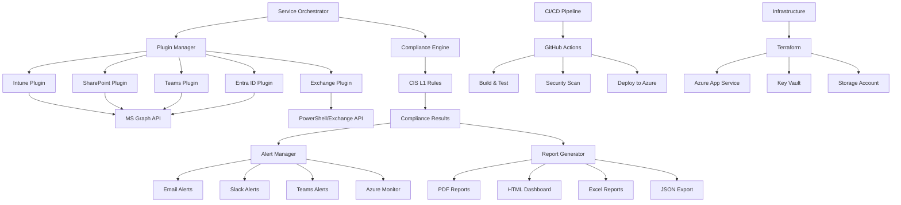

# Sarthak Singh - Automation & Integration Module Outcomes

## Module Overview
As the Automation & Integration Specialist, this module covers:
- Multi-service API orchestration for M365 compliance monitoring
- Automated deployment and DevOps pipeline
- Service extension framework for new M365 services
- Integration with alerting and reporting systems

---

## 1. Multi-Service API Orchestration Framework

### 1.1 Service Orchestrator Core Implementation

```typescript
// ServiceOrchestrator.ts
import { GraphAPIClient } from './clients/GraphAPIClient';
import { PowerShellClient } from './clients/PowerShellClient';
import { ComplianceEngine } from './compliance/ComplianceEngine';
import { ServiceConfig } from './types/ServiceConfig';

export class ServiceOrchestrator {
    private services: Map<string, ServiceConfig> = new Map();
    private graphClient: GraphAPIClient;
    private psClient: PowerShellClient;
    private complianceEngine: ComplianceEngine;

    constructor() {
        this.graphClient = new GraphAPIClient();
        this.psClient = new PowerShellClient();
        this.complianceEngine = new ComplianceEngine();
        this.initializeServices();
    }

    private initializeServices(): void {
        // Register M365 services
        this.registerService({
            name: 'Intune',
            endpoint: '/deviceManagement',
            apiVersion: 'v1.0',
            permissions: ['DeviceManagementConfiguration.Read.All'],
            complianceChecks: ['CIS-1.1.1', 'CIS-1.1.2', 'CIS-1.2.1']
        });

        this.registerService({
            name: 'ExchangeOnline',
            endpoint: '/admin/exchange',
            apiVersion: 'v1.0',
            permissions: ['Exchange.ManageAsApp'],
            complianceChecks: ['CIS-2.1.1', 'CIS-2.1.2']
        });

        this.registerService({
            name: 'SharePointOnline',
            endpoint: '/sites',
            apiVersion: 'v1.0',
            permissions: ['Sites.Read.All'],
            complianceChecks: ['CIS-3.1.1', 'CIS-3.1.2']
        });
    }

    public registerService(config: ServiceConfig): void {
        this.services.set(config.name, config);
        console.log(`Service ${config.name} registered successfully`);
    }

    public async orchestrateComplianceCheck(): Promise<ComplianceResult[]> {
        const results: ComplianceResult[] = [];
        
        for (const [serviceName, config] of this.services) {
            try {
                console.log(`Starting compliance check for ${serviceName}`);
                const serviceData = await this.collectServiceData(config);
                const complianceResult = await this.complianceEngine.evaluate(
                    serviceName, 
                    serviceData, 
                    config.complianceChecks
                );
                results.push(complianceResult);
            } catch (error) {
                console.error(`Failed to check compliance for ${serviceName}:`, error);
                results.push({
                    serviceName,
                    status: 'ERROR',
                    error: error.message,
                    timestamp: new Date()
                });
            }
        }
        
        return results;
    }

    private async collectServiceData(config: ServiceConfig): Promise<any> {
        switch (config.name) {
            case 'Intune':
                return await this.collectIntuneData();
            case 'ExchangeOnline':
                return await this.collectExchangeData();
            case 'SharePointOnline':
                return await this.collectSharePointData();
            default:
                throw new Error(`Unknown service: ${config.name}`);
        }
    }

    private async collectIntuneData(): Promise<any> {
        const endpoints = [
            '/deviceManagement/deviceConfigurations',
            '/deviceManagement/deviceCompliancePolicies',
            '/deviceManagement/deviceEnrollmentConfigurations'
        ];

        const data = {};
        for (const endpoint of endpoints) {
            data[endpoint] = await this.graphClient.get(endpoint);
        }
        return data;
    }

    private async collectExchangeData(): Promise<any> {
        // PowerShell-based data collection for Exchange Online
        const commands = [
            'Get-OrganizationConfig',
            'Get-TransportConfig',
            'Get-OwaMailboxPolicy'
        ];

        const data = {};
        for (const command of commands) {
            data[command] = await this.psClient.execute(command);
        }
        return data;
    }

    private async collectSharePointData(): Promise<any> {
        const endpoints = [
            '/admin/sharepoint/settings',
            '/sites?$select=displayName,webUrl,sharingCapability'
        ];

        const data = {};
        for (const endpoint of endpoints) {
            data[endpoint] = await this.graphClient.get(endpoint);
        }
        return data;
    }
}
```

### 1.2 Service Configuration Types

```typescript
// types/ServiceConfig.ts
export interface ServiceConfig {
    name: string;
    endpoint: string;
    apiVersion: string;
    permissions: string[];
    complianceChecks: string[];
    dataCollectionInterval?: number;
    retryPolicy?: RetryPolicy;
}

export interface RetryPolicy {
    maxRetries: number;
    retryDelay: number;
    exponentialBackoff: boolean;
}

export interface ComplianceResult {
    serviceName: string;
    status: 'COMPLIANT' | 'NON_COMPLIANT' | 'ERROR';
    findings: ComplianceFinding[];
    timestamp: Date;
    error?: string;
}

export interface ComplianceFinding {
    checkId: string;
    description: string;
    severity: 'HIGH' | 'MEDIUM' | 'LOW';
    status: 'PASS' | 'FAIL';
    remediation?: string;
}
```

---

## 2. Automated Deployment & DevOps Pipeline

### 2.1 GitHub Actions Workflow

```yaml
# .github/workflows/compliance-monitoring-ci-cd.yml
name: Compliance Monitoring CI/CD

on:
  push:
    branches: [ main, develop ]
  pull_request:
    branches: [ main ]

env:
  NODE_VERSION: '18.x'
  AZURE_APP_NAME: 'compliance-monitoring-app'

jobs:
  test:
    runs-on: ubuntu-latest
    
    steps:
    - uses: actions/checkout@v3
    
    - name: Setup Node.js
      uses: actions/setup-node@v3
      with:
        node-version: ${{ env.NODE_VERSION }}
        cache: 'npm'
    
    - name: Install dependencies
      run: npm ci
    
    - name: Run linting
      run: npm run lint
    
    - name: Run unit tests
      run: npm run test:unit
    
    - name: Run integration tests
      run: npm run test:integration
      env:
        AZURE_CLIENT_ID: ${{ secrets.AZURE_CLIENT_ID }}
        AZURE_CLIENT_SECRET: ${{ secrets.AZURE_CLIENT_SECRET }}
        AZURE_TENANT_ID: ${{ secrets.AZURE_TENANT_ID }}
    
    - name: Generate test coverage
      run: npm run test:coverage
    
    - name: Upload coverage to Codecov
      uses: codecov/codecov-action@v3

  security-scan:
    runs-on: ubuntu-latest
    needs: test
    
    steps:
    - uses: actions/checkout@v3
    
    - name: Run security audit
      run: npm audit --audit-level moderate
    
    - name: Run CodeQL analysis
      uses: github/codeql-action/analyze@v2
      with:
        languages: typescript

  build:
    runs-on: ubuntu-latest
    needs: [test, security-scan]
    
    steps:
    - uses: actions/checkout@v3
    
    - name: Setup Node.js
      uses: actions/setup-node@v3
      with:
        node-version: ${{ env.NODE_VERSION }}
    
    - name: Install dependencies
      run: npm ci
    
    - name: Build application
      run: npm run build
    
    - name: Create deployment package
      run: |
        zip -r deployment-package.zip .
        echo "PACKAGE_PATH=deployment-package.zip" >> $GITHUB_ENV
    
    - name: Upload build artifacts
      uses: actions/upload-artifact@v3
      with:
        name: build-artifacts
        path: ${{ env.PACKAGE_PATH }}

  deploy-staging:
    runs-on: ubuntu-latest
    needs: build
    if: github.ref == 'refs/heads/develop'
    environment: staging
    
    steps:
    - name: Download build artifacts
      uses: actions/download-artifact@v3
      with:
        name: build-artifacts
    
    - name: Deploy to Azure App Service (Staging)
      uses: azure/webapps-deploy@v2
      with:
        app-name: ${{ env.AZURE_APP_NAME }}-staging
        publish-profile: ${{ secrets.AZURE_PUBLISH_PROFILE_STAGING }}
        package: deployment-package.zip

  deploy-production:
    runs-on: ubuntu-latest
    needs: build
    if: github.ref == 'refs/heads/main'
    environment: production
    
    steps:
    - name: Download build artifacts
      uses: actions/download-artifact@v3
      with:
        name: build-artifacts
    
    - name: Deploy to Azure App Service (Production)
      uses: azure/webapps-deploy@v2
      with:
        app-name: ${{ env.AZURE_APP_NAME }}
        publish-profile: ${{ secrets.AZURE_PUBLISH_PROFILE_PRODUCTION }}
        package: deployment-package.zip
    
    - name: Run post-deployment health check
      run: |
        sleep 30
        curl -f https://${{ env.AZURE_APP_NAME }}.azurewebsites.net/health || exit 1
```

### 2.2 Infrastructure as Code (Terraform)

```hcl
# infrastructure/main.tf
terraform {
  required_providers {
    azurerm = {
      source  = "hashicorp/azurerm"
      version = "~>3.0"
    }
  }
}

provider "azurerm" {
  features {}
}

# Resource Group
resource "azurerm_resource_group" "compliance_monitoring" {
  name     = "rg-compliance-monitoring"
  location = "East US"
}

# App Service Plan
resource "azurerm_service_plan" "compliance_monitoring" {
  name                = "asp-compliance-monitoring"
  resource_group_name = azurerm_resource_group.compliance_monitoring.name
  location            = azurerm_resource_group.compliance_monitoring.location
  os_type             = "Linux"
  sku_name            = "P1v2"
}

# App Service
resource "azurerm_linux_web_app" "compliance_monitoring" {
  name                = "app-compliance-monitoring"
  resource_group_name = azurerm_resource_group.compliance_monitoring.name
  location            = azurerm_service_plan.compliance_monitoring.location
  service_plan_id     = azurerm_service_plan.compliance_monitoring.id

  site_config {
    application_stack {
      node_version = "18-lts"
    }
  }

  app_settings = {
    "AZURE_CLIENT_ID"     = var.azure_client_id
    "AZURE_TENANT_ID"     = var.azure_tenant_id
    "MONITORING_INTERVAL" = "3600"
    "LOG_LEVEL"          = "INFO"
  }
}

# Key Vault for secrets
resource "azurerm_key_vault" "compliance_monitoring" {
  name                = "kv-compliance-monitoring"
  location            = azurerm_resource_group.compliance_monitoring.location
  resource_group_name = azurerm_resource_group.compliance_monitoring.name
  tenant_id           = data.azurerm_client_config.current.tenant_id
  sku_name            = "standard"
}

# Storage Account for logs and reports
resource "azurerm_storage_account" "compliance_monitoring" {
  name                     = "stcompliancemonitoring"
  resource_group_name      = azurerm_resource_group.compliance_monitoring.name
  location                 = azurerm_resource_group.compliance_monitoring.location
  account_tier             = "Standard"
  account_replication_type = "LRS"
}
```

### 2.3 Docker Configuration

```dockerfile
# Dockerfile
FROM node:18-alpine AS builder

WORKDIR /app
COPY package*.json ./
RUN npm ci --only=production

COPY . .
RUN npm run build

FROM node:18-alpine AS runtime

WORKDIR /app
COPY --from=builder /app/dist ./dist
COPY --from=builder /app/node_modules ./node_modules
COPY --from=builder /app/package.json ./

EXPOSE 3000

HEALTHCHECK --interval=30s --timeout=3s --start-period=5s --retries=3 \
  CMD curl -f http://localhost:3000/health || exit 1

USER node

CMD ["node", "dist/index.js"]
```

---

## 3. Service Extension Framework

### 3.1 Plugin Architecture Implementation

```typescript
// plugins/BaseServicePlugin.ts
export abstract class BaseServicePlugin {
    abstract serviceName: string;
    abstract version: string;
    abstract supportedApiVersions: string[];

    abstract initialize(): Promise<void>;
    abstract collectData(): Promise<ServiceData>;
    abstract validateConfiguration(): Promise<ValidationResult>;
    abstract getComplianceChecks(): ComplianceCheck[];

    // Common functionality
    protected async makeApiCall(endpoint: string, options?: ApiOptions): Promise<any> {
        // Common API calling logic
    }

    protected logActivity(message: string, level: 'INFO' | 'WARN' | 'ERROR' = 'INFO'): void {
        console.log(`[${this.serviceName}] ${level}: ${message}`);
    }
}

// plugins/TeamsPlugin.ts
export class TeamsPlugin extends BaseServicePlugin {
    serviceName = 'MicrosoftTeams';
    version = '1.0.0';
    supportedApiVersions = ['v1.0', 'beta'];

    async initialize(): Promise<void> {
        this.logActivity('Initializing Microsoft Teams plugin');
        // Initialize Teams-specific configurations
    }

    async collectData(): Promise<ServiceData> {
        const data = {
            teamSettings: await this.getTeamSettings(),
            meetingPolicies: await this.getMeetingPolicies(),
            messagingPolicies: await this.getMessagingPolicies(),
            guestAccessSettings: await this.getGuestAccessSettings()
        };

        return {
            serviceName: this.serviceName,
            data,
            collectedAt: new Date(),
            dataVersion: this.version
        };
    }

    async validateConfiguration(): Promise<ValidationResult> {
        const checks = [
            this.validateTeamsSettings(),
            this.validateMeetingPolicies(),
            this.validateGuestAccess()
        ];

        const results = await Promise.all(checks);
        return {
            isValid: results.every(r => r.isValid),
            issues: results.flatMap(r => r.issues || [])
        };
    }

    getComplianceChecks(): ComplianceCheck[] {
        return [
            {
                id: 'CIS-4.1.1',
                description: 'Ensure external file sharing in Teams is disabled',
                category: 'Data Protection',
                severity: 'HIGH'
            },
            {
                id: 'CIS-4.1.2',
                description: 'Ensure guest access is properly configured',
                category: 'Access Control',
                severity: 'MEDIUM'
            }
        ];
    }

    private async getTeamSettings(): Promise<any> {
        return await this.makeApiCall('/teamwork/teamsAppSettings');
    }

    private async getMeetingPolicies(): Promise<any> {
        return await this.makeApiCall('/communications/onlineMeetings/policies');
    }

    private async getMessagingPolicies(): Promise<any> {
        return await this.makeApiCall('/communications/messaging/policies');
    }

    private async getGuestAccessSettings(): Promise<any> {
        return await this.makeApiCall('/teamwork/guestSettings');
    }

    private async validateTeamsSettings(): Promise<ValidationResult> {
        // Validation logic for Teams settings
        return { isValid: true, issues: [] };
    }

    private async validateMeetingPolicies(): Promise<ValidationResult> {
        // Validation logic for meeting policies
        return { isValid: true, issues: [] };
    }

    private async validateGuestAccess(): Promise<ValidationResult> {
        // Validation logic for guest access
        return { isValid: true, issues: [] };
    }
}
```

### 3.2 Plugin Manager

```typescript
// plugins/PluginManager.ts
export class PluginManager {
    private plugins: Map<string, BaseServicePlugin> = new Map();
    private loadedPlugins: Set<string> = new Set();

    async loadPlugin(pluginPath: string): Promise<void> {
        try {
            const PluginClass = await import(pluginPath);
            const plugin = new PluginClass.default();
            
            await plugin.initialize();
            this.plugins.set(plugin.serviceName, plugin);
            this.loadedPlugins.add(plugin.serviceName);
            
            console.log(`Plugin ${plugin.serviceName} loaded successfully`);
        } catch (error) {
            console.error(`Failed to load plugin from ${pluginPath}:`, error);
            throw error;
        }
    }

    async loadAllPlugins(): Promise<void> {
        const pluginPaths = [
            './plugins/IntunePlugin',
            './plugins/ExchangePlugin',
            './plugins/SharePointPlugin',
            './plugins/TeamsPlugin',
            './plugins/EntraIdPlugin'
        ];

        const loadPromises = pluginPaths.map(path => this.loadPlugin(path));
        await Promise.allSettled(loadPromises);
    }

    getPlugin(serviceName: string): BaseServicePlugin | undefined {
        return this.plugins.get(serviceName);
    }

    getLoadedPlugins(): string[] {
        return Array.from(this.loadedPlugins);
    }

    async collectAllServiceData(): Promise<ServiceData[]> {
        const dataPromises = Array.from(this.plugins.values()).map(async plugin => {
            try {
                return await plugin.collectData();
            } catch (error) {
                console.error(`Failed to collect data from ${plugin.serviceName}:`, error);
                return null;
            }
        });

        const results = await Promise.allSettled(dataPromises);
        return results
            .filter(result => result.status === 'fulfilled' && result.value)
            .map(result => (result as PromiseFulfilledResult<ServiceData>).value);
    }
}
```

---

## 4. Integration with Alerting & Reporting Systems

### 4.1 Alert Manager Implementation

```typescript
// alerting/AlertManager.ts
export class AlertManager {
    private alertChannels: Map<string, AlertChannel> = new Map();
    private alertRules: AlertRule[] = [];

    constructor() {
        this.initializeChannels();
        this.loadAlertRules();
    }

    private initializeChannels(): void {
        // Email alerting
        this.alertChannels.set('email', new EmailAlertChannel({
            smtpHost: process.env.SMTP_HOST,
            smtpPort: parseInt(process.env.SMTP_PORT || '587'),
            username: process.env.SMTP_USERNAME,
            password: process.env.SMTP_PASSWORD
        }));

        // Slack alerting
        this.alertChannels.set('slack', new SlackAlertChannel({
            webhookUrl: process.env.SLACK_WEBHOOK_URL,
            channel: '#compliance-alerts'
        }));

        // Teams alerting
        this.alertChannels.set('teams', new TeamsAlertChannel({
            webhookUrl: process.env.TEAMS_WEBHOOK_URL
        }));

        // Azure Monitor integration
        this.alertChannels.set('azure-monitor', new AzureMonitorChannel({
            workspaceId: process.env.AZURE_WORKSPACE_ID,
            sharedKey: process.env.AZURE_SHARED_KEY
        }));
    }

    private loadAlertRules(): void {
        this.alertRules = [
            {
                id: 'high-severity-compliance-failure',
                name: 'High Severity Compliance Failure',
                condition: (finding: ComplianceFinding) => 
                    finding.severity === 'HIGH' && finding.status === 'FAIL',
                channels: ['email', 'slack', 'azure-monitor'],
                escalation: {
                    enabled: true,
                    timeoutMinutes: 30,
                    escalationChannels: ['teams']
                }
            },
            {
                id: 'service-data-collection-failure',
                name: 'Service Data Collection Failure',
                condition: (result: ComplianceResult) => result.status === 'ERROR',
                channels: ['slack', 'azure-monitor'],
                escalation: {
                    enabled: false
                }
            }
        ];
    }

    async processComplianceResults(results: ComplianceResult[]): Promise<void> {
        for (const result of results) {
            await this.evaluateResult(result);
        }
    }

    private async evaluateResult(result: ComplianceResult): Promise<void> {
        // Check for service-level alerts
        for (const rule of this.alertRules) {
            if (rule.condition(result)) {
                await this.triggerAlert(rule, {
                    type: 'service-result',
                    data: result
                });
            }
        }

        // Check finding-level alerts
        if (result.findings) {
            for (const finding of result.findings) {
                for (const rule of this.alertRules) {
                    if (rule.condition(finding)) {
                        await this.triggerAlert(rule, {
                            type: 'compliance-finding',
                            data: finding,
                            serviceName: result.serviceName
                        });
                    }
                }
            }
        }
    }

    private async triggerAlert(rule: AlertRule, alertData: AlertData): Promise<void> {
        const alert: Alert = {
            id: this.generateAlertId(),
            ruleId: rule.id,
            ruleName: rule.name,
            severity: this.determineSeverity(alertData),
            message: this.generateAlertMessage(alertData),
            timestamp: new Date(),
            data: alertData
        };

        // Send to configured channels
        const sendPromises = rule.channels.map(channelName => {
            const channel = this.alertChannels.get(channelName);
            return channel ? channel.send(alert) : Promise.resolve();
        });

        await Promise.allSettled(sendPromises);

        // Set up escalation if enabled
        if (rule.escalation.enabled) {
            setTimeout(async () => {
                await this.checkEscalation(alert, rule);
            }, rule.escalation.timeoutMinutes * 60 * 1000);
        }
    }

    private async checkEscalation(alert: Alert, rule: AlertRule): Promise<void> {
        // Check if alert has been acknowledged or resolved
        const isResolved = await this.isAlertResolved(alert.id);
        
        if (!isResolved) {
            // Escalate to additional channels
            const escalationPromises = rule.escalation.escalationChannels.map(channelName => {
                const channel = this.alertChannels.get(channelName);
                return channel ? channel.send({
                    ...alert,
                    message: `ESCALATED: ${alert.message}`,
                    severity: 'CRITICAL'
                }) : Promise.resolve();
            });

            await Promise.allSettled(escalationPromises);
        }
    }

    private generateAlertId(): string {
        return `alert-${Date.now()}-${Math.random().toString(36).substr(2, 9)}`;
    }

    private determineSeverity(alertData: AlertData): string {
        if (alertData.type === 'compliance-finding') {
            return alertData.data.severity;
        }
        return 'MEDIUM';
    }

    private generateAlertMessage(alertData: AlertData): string {
        if (alertData.type === 'compliance-finding') {
            return `Compliance violation detected in ${alertData.serviceName}: ${alertData.data.description}`;
        } else if (alertData.type === 'service-result') {
            return `Service compliance check failed for ${alertData.data.serviceName}: ${alertData.data.error}`;
        }
        return 'Unknown alert type';
    }

    private async isAlertResolved(alertId: string): Promise<boolean> {
        // Implementation to check if alert has been resolved
        // This could check a database, external system, etc.
        return false;
    }
}
```

### 4.2 Reporting System Integration

```typescript
// reporting/ReportGenerator.ts
export class ReportGenerator {
    private templates: Map<string, ReportTemplate> = new Map();
    private outputFormats: Map<string, ReportFormatter> = new Map();

    constructor() {
        this.initializeTemplates();
        this.initializeFormatters();
    }

    private initializeTemplates(): void {
        this.templates.set('executive-summary', {
            name: 'Executive Summary',
            sections: ['overview', 'critical-findings', 'recommendations'],
            targetAudience: 'executives'
        });

        this.templates.set('technical-detailed', {
            name: 'Technical Detailed Report',
            sections: ['service-analysis', 'compliance-matrix', 'remediation-steps'],
            targetAudience: 'technical'
        });

        this.templates.set('compliance-dashboard', {
            name: 'Compliance Dashboard',
            sections: ['compliance-score', 'trend-analysis', 'service-breakdown'],
            targetAudience: 'compliance-team'
        });
    }

    private initializeFormatters(): void {
        this.outputFormats.set('pdf', new PDFFormatter());
        this.outputFormats.set('html', new HTMLFormatter());
        this.outputFormats.set('json', new JSONFormatter());
        this.outputFormats.set('excel', new ExcelFormatter());
    }

    async generateReport(
        results: ComplianceResult[],
        templateName: string,
        format: string,
        options?: ReportOptions
    ): Promise<ReportOutput> {
        const template = this.templates.get(templateName);
        const formatter = this.outputFormats.get(format);

        if (!template || !formatter) {
            throw new Error(`Template ${templateName} or format ${format} not found`);
        }

        const reportData = await this.compileReportData(results, template, options);
        const formattedReport = await formatter.format(reportData, template);

        return {
            filename: this.generateFilename(templateName, format),
            content: formattedReport,
            metadata: {
                generatedAt: new Date(),
                template: templateName,
                format,
                resultCount: results.length
            }
        };
    }

    private async compileReportData(
        results: ComplianceResult[],
        template: ReportTemplate,
        options?: ReportOptions
    ): Promise<ReportData> {
        const data: ReportData = {
            summary: this.generateSummary(results),
            services: this.groupResultsByService(results),
            timeline: this.generateTimeline(results),
            trends: await this.calculateTrends(results, options?.timeRange)
        };

        // Add template-specific data
        if (template.sections.includes('compliance-matrix')) {
            data.complianceMatrix = this.generateComplianceMatrix(results);
        }

        if (template.sections.includes('remediation-steps')) {
            data.remediationSteps = this.generateRemediationSteps(results);
        }

        return data;
    }

    private generateSummary(results: ComplianceResult[]): ReportSummary {
        const totalChecks = results.reduce((sum, r) => sum + (r.findings?.length || 0), 0);
        const passedChecks = results.reduce((sum, r) => 
            sum + (r.findings?.filter(f => f.status === 'PASS').length || 0), 0);
        const failedChecks = totalChecks - passedChecks;

        return {
            totalServices: results.length,
            totalChecks,
            passedChecks,
            failedChecks,
            complianceScore: totalChecks > 0 ? (passedChecks / totalChecks) * 100 : 0,
            criticalFindings: results.reduce((sum, r) => 
                sum + (r.findings?.filter(f => f.severity === 'HIGH' && f.status === 'FAIL').length || 0), 0)
        };
    }

    private generateFilename(templateName: string, format: string): string {
        const timestamp = new Date().toISOString().slice(0, 19).replace(/:/g, '-');
        return `compliance-report-${templateName}-${timestamp}.${format}`;
    }
}
```

---

## 5. System Architecture Flowchart



---

## 6. Deployment Scripts

### 6.1 Azure Deployment Script

```bash
#!/bin/bash
# deploy.sh

set -e

echo "Starting deployment of Compliance Monitoring System..."

# Configuration
RESOURCE_GROUP="rg-compliance-monitoring"
LOCATION="eastus"
APP_NAME="compliance-monitoring-app"
STORAGE_ACCOUNT="stcompliancemonitoring"

# Check if logged into Azure
if ! az account show > /dev/null 2>&1; then
    echo "Please login to Azure CLI first: az login"
    exit 1
fi

# Create resource group if it doesn't exist
echo "Creating resource group..."
az group create --name $RESOURCE_GROUP --location $LOCATION

# Deploy infrastructure using Terraform
echo "Deploying infrastructure with Terraform..."
cd infrastructure
terraform init
terraform plan -out=tfplan
terraform apply tfplan
cd ..

# Build and deploy application
echo "Building application..."
npm install
npm run build
npm run test

# Create deployment package
echo "Creating deployment package..."
zip -r deployment-package.zip . -x "*.git*" "*node_modules*" "*.terraform*"

# Deploy to Azure App Service
echo "Deploying to Azure App Service..."
az webapp deployment source config-zip \
    --resource-group $RESOURCE_GROUP \
    --name $APP_NAME \
    --src deployment-package.zip

# Configure app settings
echo "Configuring app settings..."
az webapp config appsettings set \
    --resource-group $RESOURCE_GROUP \
    --name $APP_NAME \
    --settings \
    NODE_ENV=production \
    MONITORING_INTERVAL=3600 \
    LOG_LEVEL=INFO \
    AZURE_CLIENT_ID=$AZURE_CLIENT_ID \
    AZURE_TENANT_ID=$AZURE_TENANT_ID

# Run health check
echo "Running health check..."
sleep 30
HEALTH_URL="https://$APP_NAME.azurewebsites.net/health"
if curl -f $HEALTH_URL; then
    echo "Deployment successful! Application is healthy."
else
    echo "Health check failed. Please check the application logs."
    exit 1
fi

echo "Deployment completed successfully!"
```

### 6.2 Local Development Setup Script

```bash
#!/bin/bash
# setup-dev.sh

echo "Setting up local development environment..."

# Check Node.js version
NODE_VERSION=$(node --version 2>/dev/null || echo "not installed")
if [[ $NODE_VERSION != v18* ]]; then
    echo "Node.js 18.x is required. Current version: $NODE_VERSION"
    echo "Please install Node.js 18.x from https://nodejs.org/"
    exit 1
fi

# Install dependencies
echo "Installing dependencies..."
npm install

# Setup environment variables
if [ ! -f .env ]; then
    echo "Creating .env file..."
    cat > .env << EOF
# Azure Configuration
AZURE_CLIENT_ID=your-client-id
AZURE_CLIENT_SECRET=your-client-secret
AZURE_TENANT_ID=your-tenant-id

# Database Configuration
DATABASE_URL=sqlite:./dev.db

# Monitoring Configuration
MONITORING_INTERVAL=300
LOG_LEVEL=DEBUG

# Alert Configuration
SMTP_HOST=smtp.gmail.com
SMTP_PORT=587
SMTP_USERNAME=your-email@gmail.com
SMTP_PASSWORD=your-app-password

# Slack Integration
SLACK_WEBHOOK_URL=https://hooks.slack.com/services/YOUR/SLACK/WEBHOOK

# Teams Integration
TEAMS_WEBHOOK_URL=https://outlook.office.com/webhook/YOUR/TEAMS/WEBHOOK
EOF
    echo "Please update .env file with your actual configuration values"
fi

# Initialize database
echo "Initializing database..."
npm run db:migrate

# Run tests to verify setup
echo "Running tests..."
npm test

echo "Development environment setup complete!"
echo "Start the application with: npm run dev"
```

---

## 7. Monitoring and Observability Implementation

### 7.1 Application Performance Monitoring

```typescript
// monitoring/PerformanceMonitor.ts
import { performance } from 'perf_hooks';
import { EventEmitter } from 'events';

export class PerformanceMonitor extends EventEmitter {
    private metrics: Map<string, PerformanceMetric[]> = new Map();
    private activeOperations: Map<string, number> = new Map();

    startOperation(operationName: string): string {
        const operationId = `${operationName}-${Date.now()}-${Math.random().toString(36).substr(2, 9)}`;
        this.activeOperations.set(operationId, performance.now());
        return operationId;
    }

    endOperation(operationId: string, metadata?: any): void {
        const startTime = this.activeOperations.get(operationId);
        if (!startTime) return;

        const duration = performance.now() - startTime;
        const operationName = operationId.split('-')[0];
        
        const metric: PerformanceMetric = {
            name: operationName,
            duration,
            timestamp: new Date(),
            metadata
        };

        if (!this.metrics.has(operationName)) {
            this.metrics.set(operationName, []);
        }
        
        this.metrics.get(operationName)!.push(metric);
        this.activeOperations.delete(operationId);

        // Emit event for real-time monitoring
        this.emit('metric', metric);

        // Check for performance issues
        this.checkPerformanceThresholds(metric);
    }

    private checkPerformanceThresholds(metric: PerformanceMetric): void {
        const thresholds = {
            'data-collection': 30000, // 30 seconds
            'compliance-check': 60000, // 1 minute
            'report-generation': 120000, // 2 minutes
            'api-call': 5000 // 5 seconds
        };

        const threshold = thresholds[metric.name];
        if (threshold && metric.duration > threshold) {
            this.emit('performance-alert', {
                operation: metric.name,
                duration: metric.duration,
                threshold,
                timestamp: metric.timestamp
            });
        }
    }

    getMetrics(operationName?: string): PerformanceMetric[] {
        if (operationName) {
            return this.metrics.get(operationName) || [];
        }
        
        return Array.from(this.metrics.values()).flat();
    }

    getAveragePerformance(operationName: string, timeWindow?: number): number {
        const metrics = this.metrics.get(operationName) || [];
        
        if (timeWindow) {
            const cutoff = Date.now() - timeWindow;
            const recentMetrics = metrics.filter(m => m.timestamp.getTime() > cutoff);
            return recentMetrics.reduce((sum, m) => sum + m.duration, 0) / recentMetrics.length;
        }
        
        return metrics.reduce((sum, m) => sum + m.duration, 0) / metrics.length;
    }
}

interface PerformanceMetric {
    name: string;
    duration: number;
    timestamp: Date;
    metadata?: any;
}
```

### 7.2 Health Check Implementation

```typescript
// monitoring/HealthChecker.ts
export class HealthChecker {
    private checks: Map<string, HealthCheck> = new Map();

    constructor() {
        this.registerDefaultChecks();
    }

    private registerDefaultChecks(): void {
        // Database connectivity check
        this.checks.set('database', {
            name: 'Database Connection',
            check: async () => {
                try {
                    // Implement actual database ping
                    await this.pingDatabase();
                    return { status: 'healthy', message: 'Database connection successful' };
                } catch (error) {
                    return { status: 'unhealthy', message: `Database error: ${error.message}` };
                }
            },
            timeout: 5000
        });

        // Azure Graph API check
        this.checks.set('graph-api', {
            name: 'Microsoft Graph API',
            check: async () => {
                try {
                    const response = await fetch('https://graph.microsoft.com/v1.0/$metadata');
                    return response.ok 
                        ? { status: 'healthy', message: 'Graph API accessible' }
                        : { status: 'unhealthy', message: `Graph API returned ${response.status}` };
                } catch (error) {
                    return { status: 'unhealthy', message: `Graph API error: ${error.message}` };
                }
            },
            timeout: 10000
        });

        // Plugin status check
        this.checks.set('plugins', {
            name: 'Service Plugins',
            check: async () => {
                const pluginManager = new PluginManager();
                const loadedPlugins = pluginManager.getLoadedPlugins();
                
                if (loadedPlugins.length === 0) {
                    return { status: 'unhealthy', message: 'No plugins loaded' };
                }
                
                return { 
                    status: 'healthy', 
                    message: `${loadedPlugins.length} plugins loaded: ${loadedPlugins.join(', ')}` 
                };
            },
            timeout: 3000
        });

        // Storage account check
        this.checks.set('storage', {
            name: 'Azure Storage',
            check: async () => {
                try {
                    // Implement storage account connectivity check
                    await this.checkStorageAccount();
                    return { status: 'healthy', message: 'Storage account accessible' };
                } catch (error) {
                    return { status: 'unhealthy', message: `Storage error: ${error.message}` };
                }
            },
            timeout: 5000
        });
    }

    async runHealthChecks(): Promise<HealthCheckResult> {
        const results: Map<string, CheckResult> = new Map();
        let overallStatus: 'healthy' | 'degraded' | 'unhealthy' = 'healthy';

        const checkPromises = Array.from(this.checks.entries()).map(async ([name, check]) => {
            try {
                const result = await Promise.race([
                    check.check(),
                    new Promise<CheckResult>((_, reject) => 
                        setTimeout(() => reject(new Error('Timeout')), check.timeout)
                    )
                ]);
                
                results.set(name, result);
                
                if (result.status === 'unhealthy') {
                    overallStatus = 'unhealthy';
                } else if (result.status === 'degraded' && overallStatus === 'healthy') {
                    overallStatus = 'degraded';
                }
            } catch (error) {
                results.set(name, { 
                    status: 'unhealthy', 
                    message: `Check failed: ${error.message}` 
                });
                overallStatus = 'unhealthy';
            }
        });

        await Promise.all(checkPromises);

        return {
            status: overallStatus,
            timestamp: new Date(),
            checks: Object.fromEntries(results)
        };
    }

    private async pingDatabase(): Promise<void> {
        // Implement database ping logic
        return Promise.resolve();
    }

    private async checkStorageAccount(): Promise<void> {
        // Implement storage account check logic
        return Promise.resolve();
    }
}

interface HealthCheck {
    name: string;
    check: () => Promise<CheckResult>;
    timeout: number;
}

interface CheckResult {
    status: 'healthy' | 'degraded' | 'unhealthy';
    message: string;
}

interface HealthCheckResult {
    status: 'healthy' | 'degraded' | 'unhealthy';
    timestamp: Date;
    checks: Record<string, CheckResult>;
}
```

---

## 8. Error Handling and Resilience Patterns

### 8.1 Circuit Breaker Implementation

```typescript
// resilience/CircuitBreaker.ts
export class CircuitBreaker {
    private state: 'CLOSED' | 'OPEN' | 'HALF_OPEN' = 'CLOSED';
    private failureCount = 0;
    private successCount = 0;
    private lastFailureTime?: Date;
    private nextAttempt?: Date;

    constructor(
        private options: CircuitBreakerOptions = {
            failureThreshold: 5,
            resetTimeout: 60000,
            monitoringPeriod: 10000,
            expectedErrorRate: 0.5
        }
    ) {}

    async execute<T>(operation: () => Promise<T>): Promise<T> {
        if (this.state === 'OPEN') {
            if (this.shouldAttemptReset()) {
                this.state = 'HALF_OPEN';
            } else {
                throw new Error('Circuit breaker is OPEN');
            }
        }

        try {
            const result = await operation();
            this.onSuccess();
            return result;
        } catch (error) {
            this.onFailure();
            throw error;
        }
    }

    private onSuccess(): void {
        this.failureCount = 0;
        if (this.state === 'HALF_OPEN') {
            this.state = 'CLOSED';
        }
        this.successCount++;
    }

    private onFailure(): void {
        this.failureCount++;
        this.lastFailureTime = new Date();

        if (this.failureCount >= this.options.failureThreshold) {
            this.state = 'OPEN';
            this.nextAttempt = new Date(Date.now() + this.options.resetTimeout);
        }
    }

    private shouldAttemptReset(): boolean {
        return this.nextAttempt ? new Date() >= this.nextAttempt : false;
    }

    getState(): string {
        return this.state;
    }

    getStats(): CircuitBreakerStats {
        return {
            state: this.state,
            failureCount: this.failureCount,
            successCount: this.successCount,
            lastFailureTime: this.lastFailureTime
        };
    }
}

interface CircuitBreakerOptions {
    failureThreshold: number;
    resetTimeout: number;
    monitoringPeriod: number;
    expectedErrorRate: number;
}

interface CircuitBreakerStats {
    state: string;
    failureCount: number;
    successCount: number;
    lastFailureTime?: Date;
}
```

### 8.2 Retry Logic with Exponential Backoff

```typescript
// resilience/RetryHandler.ts
export class RetryHandler {
    async executeWithRetry<T>(
        operation: () => Promise<T>,
        options: RetryOptions = {}
    ): Promise<T> {
        const {
            maxRetries = 3,
            baseDelay = 1000,
            maxDelay = 30000,
            exponentialBase = 2,
            jitter = true,
            retryCondition = (error) => true
        } = options;

        let lastError: Error;
        
        for (let attempt = 0; attempt <= maxRetries; attempt++) {
            try {
                return await operation();
            } catch (error) {
                lastError = error as Error;
                
                if (attempt === maxRetries || !retryCondition(error)) {
                    throw error;
                }
                
                const delay = this.calculateDelay(
                    attempt, 
                    baseDelay, 
                    maxDelay, 
                    exponentialBase, 
                    jitter
                );
                
                console.log(`Attempt ${attempt + 1} failed. Retrying in ${delay}ms...`);
                await this.sleep(delay);
            }
        }
        
        throw lastError!;
    }

    private calculateDelay(
        attempt: number,
        baseDelay: number,
        maxDelay: number,
        exponentialBase: number,
        jitter: boolean
    ): number {
        let delay = Math.min(baseDelay * Math.pow(exponentialBase, attempt), maxDelay);
        
        if (jitter) {
            delay = delay * (0.5 + Math.random() * 0.5);
        }
        
        return Math.floor(delay);
    }

    private sleep(ms: number): Promise<void> {
        return new Promise(resolve => setTimeout(resolve, ms));
    }
}

interface RetryOptions {
    maxRetries?: number;
    baseDelay?: number;
    maxDelay?: number;
    exponentialBase?: number;
    jitter?: boolean;
    retryCondition?: (error: any) => boolean;
}
```

---

## 9. Integration Tests and Validation

### 9.1 Integration Test Suite

```typescript
// tests/integration/ServiceOrchestrator.test.ts
import { describe, it, expect, beforeEach, jest } from '@jest/globals';
import { ServiceOrchestrator } from '../../src/ServiceOrchestrator';
import { PluginManager } from '../../src/plugins/PluginManager';

describe('ServiceOrchestrator Integration Tests', () => {
    let orchestrator: ServiceOrchestrator;
    let mockPluginManager: jest.Mocked<PluginManager>;

    beforeEach(() => {
        mockPluginManager = {
            loadAllPlugins: jest.fn(),
            getLoadedPlugins: jest.fn(),
            collectAllServiceData: jest.fn()
        } as any;

        orchestrator = new ServiceOrchestrator();
    });

    describe('Multi-Service Data Collection', () => {
        it('should collect data from all registered services', async () => {
            // Arrange
            const mockServiceData = [
                {
                    serviceName: 'Intune',
                    data: { policies: [] },
                    collectedAt: new Date()
                },
                {
                    serviceName: 'ExchangeOnline',
                    data: { transportRules: [] },
                    collectedAt: new Date()
                }
            ];

            mockPluginManager.collectAllServiceData.mockResolvedValue(mockServiceData);

            // Act
            const results = await orchestrator.orchestrateComplianceCheck();

            // Assert
            expect(results).toHaveLength(2);
            expect(results[0].serviceName).toBe('Intune');
            expect(results[1].serviceName).toBe('ExchangeOnline');
        });

        it('should handle service failures gracefully', async () => {
            // Arrange
            mockPluginManager.collectAllServiceData.mockRejectedValue(
                new Error('Service unavailable')
            );

            // Act
            const results = await orchestrator.orchestrateComplianceCheck();

            // Assert
            expect(results).toEqual(
                expect.arrayContaining([
                    expect.objectContaining({
                        status: 'ERROR',
                        error: expect.stringContaining('Service unavailable')
                    })
                ])
            );
        });
    });

    describe('Plugin Loading and Management', () => {
        it('should load all available plugins successfully', async () => {
            // Arrange
            const expectedPlugins = ['Intune', 'ExchangeOnline', 'SharePointOnline', 'Teams'];
            mockPluginManager.getLoadedPlugins.mockReturnValue(expectedPlugins);

            // Act
            await mockPluginManager.loadAllPlugins();
            const loadedPlugins = mockPluginManager.getLoadedPlugins();

            // Assert
            expect(mockPluginManager.loadAllPlugins).toHaveBeenCalled();
            expect(loadedPlugins).toEqual(expectedPlugins);
        });
    });

    describe('Compliance Evaluation', () => {
        it('should evaluate compliance for multiple CIS controls', async () => {
            // Arrange
            const complianceChecks = ['CIS-1.1.1', 'CIS-1.1.2', 'CIS-2.1.1'];
            
            // Act
            const results = await orchestrator.orchestrateComplianceCheck();

            // Assert
            results.forEach(result => {
                if (result.status !== 'ERROR') {
                    expect(result.findings).toBeDefined();
                    expect(Array.isArray(result.findings)).toBe(true);
                }
            });
        });
    });
});
```

### 9.2 End-to-End Pipeline Test

```typescript
// tests/e2e/CompliancePipeline.test.ts
import { describe, it, expect, beforeAll, afterAll } from '@jest/globals';
import { ServiceOrchestrator } from '../../src/ServiceOrchestrator';
import { AlertManager } from '../../src/alerting/AlertManager';
import { ReportGenerator } from '../../src/reporting/ReportGenerator';

describe('End-to-End Compliance Pipeline', () => {
    let orchestrator: ServiceOrchestrator;
    let alertManager: AlertManager;
    let reportGenerator: ReportGenerator;

    beforeAll(async () => {
        orchestrator = new ServiceOrchestrator();
        alertManager = new AlertManager();
        reportGenerator = new ReportGenerator();
    });

    it('should execute complete compliance monitoring workflow', async () => {
        // Step 1: Data Collection
        const complianceResults = await orchestrator.orchestrateComplianceCheck();
        expect(complianceResults).toBeDefined();
        expect(complianceResults.length).toBeGreaterThan(0);

        // Step 2: Alert Processing
        await alertManager.processComplianceResults(complianceResults);
        
        // Step 3: Report Generation
        const report = await reportGenerator.generateReport(
            complianceResults,
            'executive-summary',
            'pdf'
        );
        
        expect(report).toBeDefined();
        expect(report.filename).toContain('compliance-report');
        expect(report.content).toBeDefined();

        // Step 4: Verify compliance scoring
        const summary = report.metadata;
        expect(summary.resultCount).toBe(complianceResults.length);
    }, 60000); // 60 second timeout for full pipeline

    it('should handle service outages gracefully', async () => {
        // Simulate service outage by mocking API failures
        jest.spyOn(global, 'fetch').mockRejectedValue(new Error('Service unavailable'));

        const results = await orchestrator.orchestrateComplianceCheck();
        
        // Should still return results, but with error status
        expect(results).toBeDefined();
        results.forEach(result => {
            if (result.status === 'ERROR') {
                expect(result.error).toBeDefined();
            }
        });

        // Restore original fetch
        jest.restoreAllMocks();
    });
});
```

---

## 10. Performance Benchmarks and Optimization

### 10.1 Performance Benchmark Suite

```typescript
// tests/performance/Benchmarks.test.ts
import { describe, it, expect } from '@jest/globals';
import { PerformanceMonitor } from '../../src/monitoring/PerformanceMonitor';
import { ServiceOrchestrator } from '../../src/ServiceOrchestrator';

describe('Performance Benchmarks', () => {
    let performanceMonitor: PerformanceMonitor;
    let orchestrator: ServiceOrchestrator;

    beforeEach(() => {
        performanceMonitor = new PerformanceMonitor();
        orchestrator = new ServiceOrchestrator();
    });

    it('should complete data collection within performance thresholds', async () => {
        const operationId = performanceMonitor.startOperation('data-collection');
        
        try {
            await orchestrator.orchestrateComplianceCheck();
        } finally {
            performanceMonitor.endOperation(operationId);
        }

        const metrics = performanceMonitor.getMetrics('data-collection');
        const lastMetric = metrics[metrics.length - 1];
        
        // Should complete within 30 seconds
        expect(lastMetric.duration).toBeLessThan(30000);
    });

    it('should handle concurrent compliance checks efficiently', async () => {
        const concurrentChecks = 5;
        const promises = Array(concurrentChecks).fill(null).map(async (_, index) => {
            const operationId = performanceMonitor.startOperation(`concurrent-check-${index}`);
            
            try {
                return await orchestrator.orchestrateComplianceCheck();
            } finally {
                performanceMonitor.endOperation(operationId);
            }
        });

        const results = await Promise.all(promises);
        
        expect(results).toHaveLength(concurrentChecks);
        results.forEach(result => {
            expect(result).toBeDefined();
            expect(Array.isArray(result)).toBe(true);
        });

        // Verify no significant performance degradation under load
        for (let i = 0; i < concurrentChecks; i++) {
            const metrics = performanceMonitor.getMetrics(`concurrent-check-${i}`);
            expect(metrics[0].duration).toBeLessThan(45000); // Allow 50% overhead for concurrency
        }
    });

    it('should maintain memory efficiency during long-running operations', async () => {
        const initialMemory = process.memoryUsage().heapUsed;
        
        // Run multiple cycles to test for memory leaks
        for (let i = 0; i < 10; i++) {
            await orchestrator.orchestrateComplianceCheck();
            
            // Force garbage collection if available
            if (global.gc) {
                global.gc();
            }
        }

        const finalMemory = process.memoryUsage().heapUsed;
        const memoryIncrease = finalMemory - initialMemory;
        
        // Memory increase should be reasonable (less than 100MB)
        expect(memoryIncrease).toBeLessThan(100 * 1024 * 1024);
    });
});
```

---

## 11. Documentation and Deployment Guide

### 11.1 API Documentation Generation

```typescript
// docs/generateApiDocs.ts
import swaggerJsdoc from 'swagger-jsdoc';
import swaggerUi from 'swagger-ui-express';
import { Express } from 'express';

const options = {
    definition: {
        openapi: '3.0.0',
        info: {
            title: 'Compliance Monitoring API',
            version: '1.0.0',
            description: 'Automated Compliance Monitoring for Microsoft 365 Services',
        },
        servers: [
            {
                url: 'https://compliance-monitoring-app.azurewebsites.net',
                description: 'Production server',
            },
            {
                url: 'http://localhost:3000',
                description: 'Development server',
            },
        ],
    },
    apis: ['./src/routes/*.ts', './src/controllers/*.ts'],
};

const specs = swaggerJsdoc(options);

export function setupApiDocs(app: Express): void {
    app.use('/api-docs', swaggerUi.serve, swaggerUi.setup(specs));
}

/**
 * @swagger
 * /api/compliance/check:
 *   post:
 *     summary: Trigger compliance check for specified services
 *     tags: [Compliance]
 *     requestBody:
 *       required: true
 *       content:
 *         application/json:
 *           schema:
 *             type: object
 *             properties:
 *               services:
 *                 type: array
 *                 items:
 *                   type: string
 *                 example: ["Intune", "ExchangeOnline"]
 *               checkTypes:
 *                 type: array
 *                 items:
 *                   type: string
 *                 example: ["CIS-1.1.1", "CIS-1.1.2"]
 *     responses:
 *       200:
 *         description: Compliance check completed successfully
 *         content:
 *           application/json:
 *             schema:
 *               type: object
 *               properties:
 *                 status:
 *                   type: string
 *                   example: "success"
 *                 results:
 *                   type: array
 *                   items:
 *                     $ref: '#/components/schemas/ComplianceResult'
 */
```

### 11.2 Deployment Validation Script

```bash
#!/bin/bash
# validate-deployment.sh

echo "Validating deployment of Compliance Monitoring System..."

# Configuration
APP_URL="https://compliance-monitoring-app.azurewebsites.net"
HEALTH_ENDPOINT="$APP_URL/health"
API_ENDPOINT="$APP_URL/api/compliance/status"

# Function to check HTTP endpoint
check_endpoint() {
    local url=$1
    local expected_status=$2
    local timeout=${3:-10}
    
    echo "Checking $url..."
    
    response=$(curl -s -w "HTTPSTATUS:%{http_code}" --max-time $timeout "$url")
    http_code=$(echo $response | grep -o "HTTPSTATUS:[0-9]*" | cut -d: -f2)
    body=$(echo $response | sed -E 's/HTTPSTATUS:[0-9]*$//')
    
    if [ "$http_code" -eq "$expected_status" ]; then
        echo "✅ $url returned expected status $expected_status"
        return 0
    else
        echo "❌ $url returned status $http_code, expected $expected_status"
        echo "Response body: $body"
        return 1
    fi
}

# Function to validate API functionality
validate_api() {
    echo "Validating API functionality..."
    
    # Test health endpoint
    if ! check_endpoint "$HEALTH_ENDPOINT" 200 15; then
        echo "❌ Health check failed"
        return 1
    fi
    
    # Test API status endpoint
    if ! check_endpoint "$API_ENDPOINT" 200 20; then
        echo "❌ API status check failed"
        return 1
    fi
    
    # Test compliance check endpoint (if available)
    echo "Testing compliance check API..."
    response=$(curl -s -X POST "$APP_URL/api/compliance/check" \
        -H "Content-Type: application/json" \
        -d '{"services": ["Intune"], "dryRun": true}' \
        --max-time 30)
    
    if [ $? -eq 0 ]; then
        echo "✅ Compliance check API responding"
    else
        echo "⚠️  Compliance check API test failed (may require authentication)"
    fi
    
    return 0
}

# Function to check Azure resources
validate_azure_resources() {
    echo "Validating Azure resources..."
    
    # Check if resource group exists
    if az group show --name "rg-compliance-monitoring" > /dev/null 2>&1; then
        echo "✅ Resource group exists"
    else
        echo "❌ Resource group not found"
        return 1
    fi
    
    # Check if app service exists
    if az webapp show --name "compliance-monitoring-app" --resource-group "rg-compliance-monitoring" > /dev/null 2>&1; then
        echo "✅ App Service exists"
    else
        echo "❌ App Service not found"
        return 1
    fi
    
    # Check if storage account exists
    if az storage account show --name "stcompliancemonitoring" --resource-group "rg-compliance-monitoring" > /dev/null 2>&1; then
        echo "✅ Storage Account exists"
    else
        echo "❌ Storage Account not found"
        return 1
    fi
    
    return 0
}

# Function to run performance tests
validate_performance() {
    echo "Running basic performance validation..."
    
    # Measure response time for health endpoint
    start_time=$(date +%s%N)
    check_endpoint "$HEALTH_ENDPOINT" 200 30
    end_time=$(date +%s%N)
    
    duration=$((($end_time - $start_time) / 1000000)) # Convert to milliseconds
    
    if [ $duration -lt 2000 ]; then
        echo "✅ Health endpoint response time: ${duration}ms (good)"
    elif [ $duration -lt 5000 ]; then
        echo "⚠️  Health endpoint response time: ${duration}ms (acceptable)"
    else
        echo "❌ Health endpoint response time: ${duration}ms (too slow)"
        return 1
    fi
    
    return 0
}

# Main validation flow
main() {
    echo "=================================================="
    echo "Deployment Validation Started: $(date)"
    echo "=================================================="
    
    validation_failed=0
    
    # Check if Azure CLI is available and logged in
    if ! az account show > /dev/null 2>&1; then
        echo "⚠️  Azure CLI not logged in. Skipping Azure resource validation."
    else
        if ! validate_azure_resources; then
            validation_failed=1
        fi
    fi
    
    # Validate API functionality
    if ! validate_api; then
        validation_failed=1
    fi
    
    # Run performance validation
    if ! validate_performance; then
        validation_failed=1
    fi
    
    echo "=================================================="
    if [ $validation_failed -eq 0 ]; then
        echo "🎉 All validations passed! Deployment is successful."
        echo "Application URL: $APP_URL"
        echo "API Documentation: $APP_URL/api-docs"
        exit 0
    else
        echo "❌ Some validations failed. Please check the deployment."
        exit 1
    fi
}

# Run main function
main